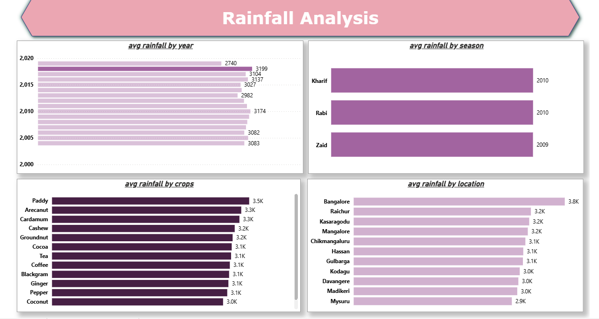
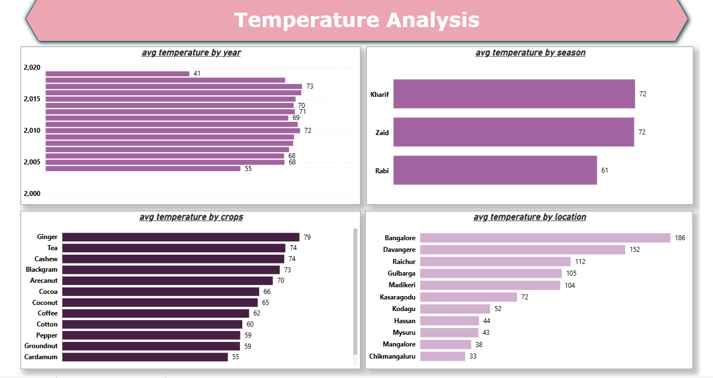

# 🌧️ Rainfall Analytics Dashboard

## Project Overview

The Rainfall Analytics Dashboard is an end-to-end Business Intelligence project developed using AWS, Snowflake, SQL, and Power BI. The objective of this project is to analyze rainfall patterns, identify seasonal trends, and provide actionable insights through interactive visualizations.

The project demonstrates the complete data analytics workflow, including cloud data storage, data transformation, modeling, and dashboard development.

---

## Technology Stack

* AWS Cloud
* Snowflake Data Warehouse
* SQL
* Power BI
* Power Query
* DAX (Data Analysis Expressions)

---

## Dataset

**Dataset Name:** Rainfall

The dataset contains rainfall-related information used to analyze precipitation patterns across different regions and time periods.

Key fields include:

* Date
* Region/Location
* Rainfall Amount
* Month
* Year
* Seasonal Information

---

## Data Pipeline

1. Rainfall data loaded into AWS environment.
2. Data stored and managed in Snowflake.
3. SQL queries used for data cleaning and transformation.
4. Power BI connected directly to Snowflake.
5. Data modeling performed using relationships and calculated measures.
6. Interactive reports and dashboards created in Power BI.

---

## Dashboard Features

* Total Rainfall Overview
* Monthly Rainfall Trends
* Yearly Rainfall Analysis
* Region-wise Rainfall Distribution
* Seasonal Rainfall Comparison
* Interactive Filters and Slicers
* Dynamic KPI Cards

---

## Key Insights

* Identified rainfall variations across different regions.
* Analyzed seasonal and yearly precipitation patterns.
* Monitored rainfall trends over time.
* Enabled data-driven reporting through interactive dashboards.

---

## Project Screenshots

### Dashboard Overview

## Skills Demonstrated

* Data Analytics
* Business Intelligence
* Data Visualization
* SQL Querying
* Cloud Data Warehousing
* Data Modeling
* Dashboard Development
* DAX Calculations
* Snowflake
* AWS
* Power BI

---

## Author

**Mohammad Saquib**

Data Analyst | Power BI Developer | AI & ML Graduate

LinkedIn: https://www.linkedin.com/in/mohammad-saquib-0ab9452b8/
